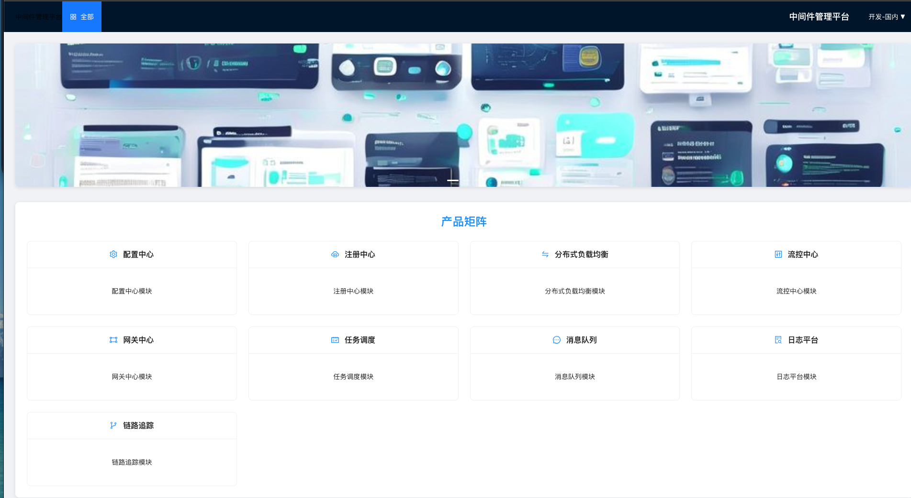
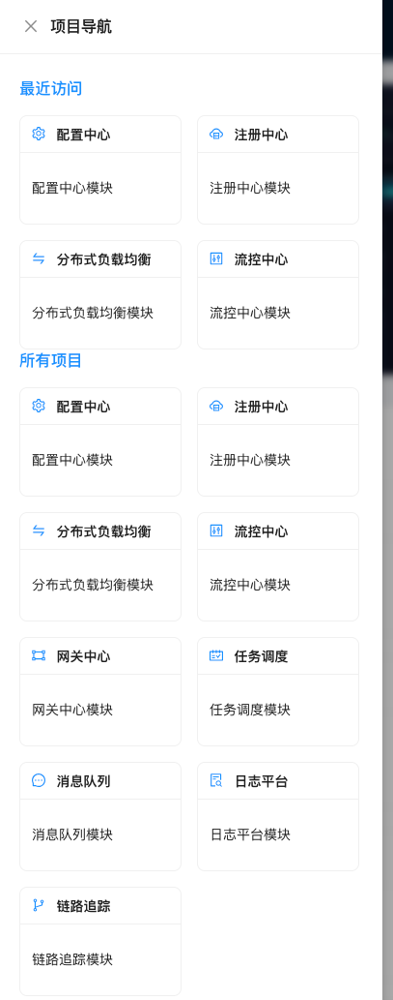

# 中间件管理平台

这是一个基于Spring Boot + MyBatis Plus的中间件管理平台，提供了配置中心、注册中心、消息队列、网关等多个模块的集成管理功能。

## 项目架构

### 后端架构

- **技术栈**：Java 1.8 + Spring Boot 2.7.0 + MyBatis Plus 3.5.3.1
- **构建工具**：Maven
- **模块划分**：

| 模块名称 | 端口号 | 功能描述 |
|---------|-------|---------|
| middleware-platform-server-config-center | 8081 | 配置中心 - 集中管理应用配置，支持配置推送和热更新 |
| middleware-platform-server-registry-center | 8086 | 注册中心 - 服务注册与发现，支持健康检查和负载均衡 |
| middleware-platform-server-mq | 8080 | 消息队列 - 异步消息处理，支持多种消息中间件 |
| middleware-platform-server-gateway-center | 8084 | 网关中心 - API网关，支持路由转发、限流和熔断 |
| middleware-platform-server-flow-control-center | 8083 | 流控中心 - 流量控制，支持分布式限流和熔断 |
| middleware-platform-server-dlb | 8082 | 分布式负载均衡 - 智能负载均衡策略，支持多种算法 |
| middleware-platform-server-job | 8085 | 任务调度管理 - 定时任务调度，支持分布式任务执行 |
| middleware-platform-server-log-platform | 8087 | 日志平台 - 日志收集和分析，支持实时查询和可视化 |

### 前端架构

- **技术栈**：React 18 + Ant Design + Vite
- **构建工具**：Vite
- **功能特点**：
  - 现代化UI设计，响应式布局
  - 统一的项目导航和页面布局
  - 实时数据可视化图表
  - 多环境部署管理
  - 自动化部署流程

## 项目交互演示

### 首页

首页展示了平台的综合概览，包括轮播图和产品矩阵。轮播图展示了平台的核心功能和特点，产品矩阵列出了所有可用的中间件模块。



### 项目导航

项目导航提供了两种方式：
1. 顶部导航栏 - 可以快速返回首页和切换环境
2. 侧边抽屉 - 提供了最近访问和所有项目的导航



## 构建和运行

### 后端

每个模块都是独立的Spring Boot应用，可以单独构建和运行：

```bash
# 进入任意模块目录
cd middleware-platform-server/middleware-platform-server-{module-name}

# 构建项目
mvn clean package

# 运行项目
mvn spring-boot:run
```

或者直接运行jar包：

```bash
java -jar target/middleware-platform-server-{module-name}-0.0.1-SNAPSHOT.jar
```

### 前端

```bash
# 进入前端项目目录
cd middleware-platform-front

# 安装依赖
npm install

# 启动开发服务器
npm run dev

# 构建生产版本
npm run build
```

## 使用说明

1. 启动后端服务：按模块顺序启动各个后端服务
2. 启动前端服务：运行 `npm run dev` 启动前端开发服务器
3. 访问平台：在浏览器中访问 http://localhost:3000（或其他指定端口）
4. 导航和操作：使用顶部导航栏和侧边抽屉导航到各个模块页面

## 技术亮点

- **模块化架构**：后端采用模块化设计，每个模块独立部署和维护
- **高性能**：前端使用 React 和 Vite 构建，提供快速的开发和运行体验
- **高可用**：支持多环境部署和服务发现，确保系统的高可用性
- **可扩展性**：架构设计支持模块的灵活扩展和定制
- **易维护**：统一的代码风格和架构设计，便于团队协作和维护